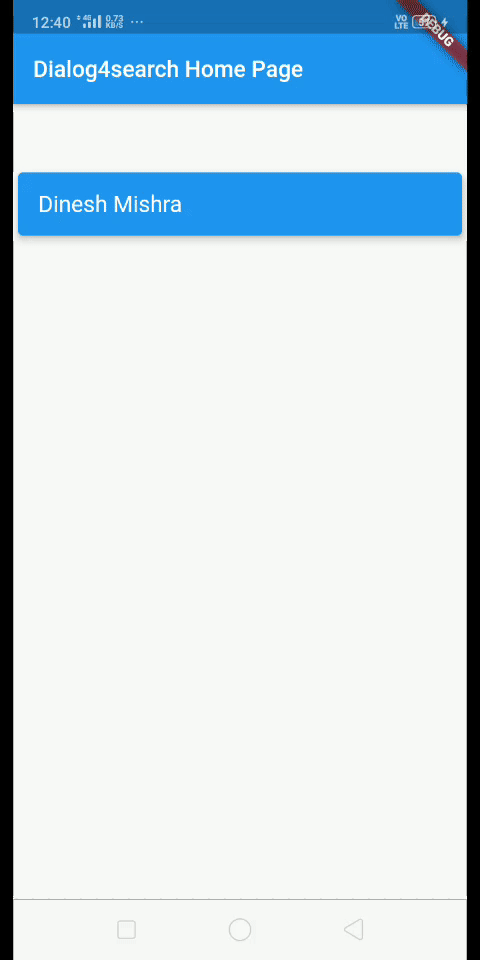
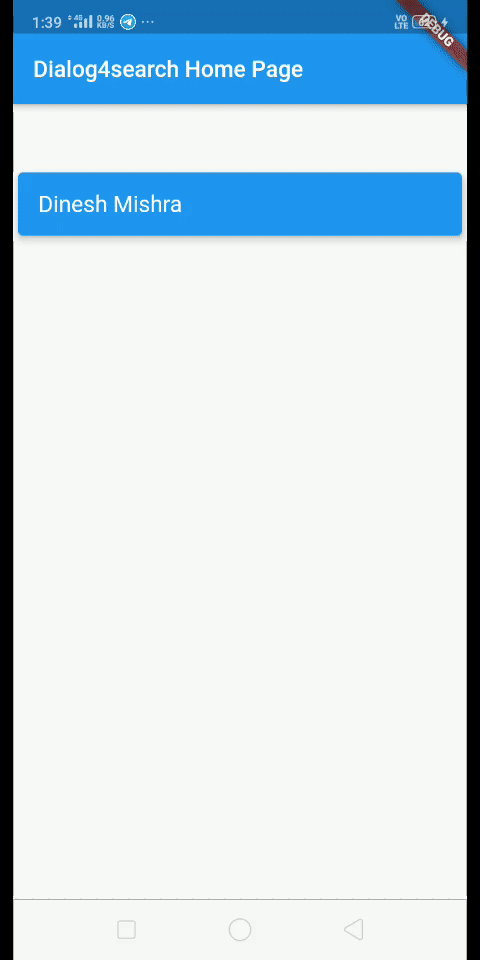

# dialog4search

A package in which user can search for an item in a given list.

## Usage

To use this plugin, add dialog4search as a [dependency in your pubspec.yaml file.](https://flutter.dev/docs/development/packages-and-plugins/using-packages)

## Dialog with single selection



## Dialog with multiple selection



### Example


```dart


import 'package:dialog4search/dialog4search.dart';
import 'package:flutter/material.dart';

void main() {
  runApp(MyApp());
}

class MyApp extends StatelessWidget {
  // This widget is the root of your application.
  @override
  Widget build(BuildContext context) {
    return MaterialApp(
      title: 'Dialog4search',
      theme: ThemeData(
        primarySwatch: Colors.blue,
        visualDensity: VisualDensity.adaptivePlatformDensity,
      ),
      home: MyHomePage(title: 'Dialog4search Home Page'),
    );
  }
}

class MyHomePage extends StatefulWidget {
  MyHomePage({Key key, this.title}) : super(key: key);

  final String title;


  @override
  _MyHomePageState createState() => _MyHomePageState();
}

class _MyHomePageState extends State<MyHomePage> {
  List<Person> _selectedPersons=[];
  InputDecoration _searchBoxDecoration=InputDecoration(
      hintText: 'Search by father or sons name',
      contentPadding: EdgeInsets.symmetric(horizontal: 10,vertical: 0),
      border: OutlineInputBorder(borderSide: BorderSide(color: Colors.black)),
      filled: true,
      hintStyle: TextStyle(fontSize: 16, color: Colors.grey));

  bool _onSearch(person, value) {
    return person.fathersName
        .toUpperCase()
        .contains(value.toUpperCase()) ||
        person.name.toUpperCase().contains(value.toUpperCase());
  }

  Widget _itemBuilder(context, person) {
    return Container(
      color: Colors.white,
      child: Column(
        mainAxisSize: MainAxisSize.min,
        crossAxisAlignment: CrossAxisAlignment.start,
        children: [
          Text("Person: ${person.name}"),
          Text("Father: ${person.fathersName}"),
        ],
      ),
    );
  }

  Widget _builder(context, person) {
    return Card(
      color: Colors.blue,
      elevation: 5,
      child: Container(
        width: MediaQuery.of(context).size.width,
        height: 50,
        alignment: Alignment.centerLeft,
        padding: EdgeInsets.only(left: 16),
        child: Text("${person.name}",style: TextStyle(color: Colors.white,fontSize: 20),),
      ),
    );
  }

  void _onChange(persons){
    setState(() {
      _selectedPersons=persons;
    });
  }

  _displaySelectedItems(){
    return Expanded(child: ListView.separated(itemBuilder: (context,index){
      var person=_selectedPersons[index];
      return Container(
        color: Colors.white,
        padding: EdgeInsets.all(20),
        child: Column(
          mainAxisSize: MainAxisSize.min,
          crossAxisAlignment: CrossAxisAlignment.start,
          children: [
            Text("Person: ${person.name}"),
            Text("Father: ${person.fathersName}"),
          ],
        ),
      );
    }, separatorBuilder: (context,index){
      return Divider();
    }, itemCount: _selectedPersons.length));
  }

  @override
  Widget build(BuildContext context) {

    return Scaffold(
      appBar: AppBar(
        title: Text(widget.title),
      ),
      body: Center(
        child: Column(
          mainAxisAlignment: MainAxisAlignment.center,
          children: <Widget>[
            SizedBox(height: 50,),
            Dialog4Search<Person>(
              //uncomment the line below to change the background color of the dialog box
              multipleSelect: true,
              searchFunction: _onSearch,
              itemBuilder: _itemBuilder,
              list: testData,
              builder: _builder,
              searchBoxDecoration: _searchBoxDecoration,
              onChanged: _onChange,
              onInitialization: (person){
                print("${person.name}");
              },
              initialValue: testData[2],

            //uncomment the line below to change the background color of the dialog box
//              dialogBoxBackgroundColor: Colors.red,

            // You can set your icon to show the election of your item.
//            selectionIcon: Icon(Icons.check),

            //Using dialog shape property you can change the shape of the dialog
//            dialogShape: ,
            //if you pass no match builder then it will be shown when item is not found in the list
//            noMatchBuilder: ,
            ),
            _displaySelectedItems()
          ],
        ),
      ),
    );
  }
}

class Person {
  final String name;
  final String fathersName;
  Person({this.name, this.fathersName});
}

var testData = [
  Person(name: 'Anuj Patel', fathersName: 'Ram Lal Patel'),
  Person(name: 'Anuj Verma', fathersName: 'Ram Lal Verma'),
  Person(name: 'Dinesh Mishra', fathersName: 'Mintu Mishra'),
  Person(name: 'Kapil Gupta', fathersName: 'Jhanni Lal Gupta'),
  Person(name: 'Rajpal verma', fathersName: 'Baburam verma'),
  Person(name: 'Satendra Rathod', fathersName: 'Kamlesh Rathod'),
  Person(name: 'Shuresh Kumar', fathersName: 'Tikaram verma'),
  Person(name: 'Omkar kashyap', fathersName: 'Khanna kashyap'),
  Person(name: 'Sachin kumar', fathersName: 'Omkar kashyap'),
  Person(name: 'Sudheer Pandey', fathersName: 'Anchal Pandey'),
  Person(name: 'Priya prakash', fathersName: 'Ratnesh Kumar'),
  Person(name: 'Shipra', fathersName: 'Jayram Rajan'),
  Person(name: 'Druv Tiwari', fathersName: 'Govind Tiwari'),
  Person(name: 'Karnesh Baghel', fathersName: 'Karanjeet Baghel'),
  Person(name: 'Rupesh Chauhan', fathersName: 'Rakesh Chauhan'),
  Person(name: 'Somesh Yadav', fathersName: 'Ganesh Yadav'),
  Person(name: 'Dashmesh Singh', fathersName: 'Tara Singh'),
  Person(name: 'Tapshi juneja', fathersName: 'Amar juneja'),
  Person(name: 'Nihal Jaiswal', fathersName: 'Akash'),
  Person(name: 'Fatima ', fathersName: 'Akbar Ali'),
];


```

For help getting started with Flutter, view our 
[online documentation](https://flutter.dev/docs), which offers tutorials, 
samples, guidance on mobile development, and a full API reference.
